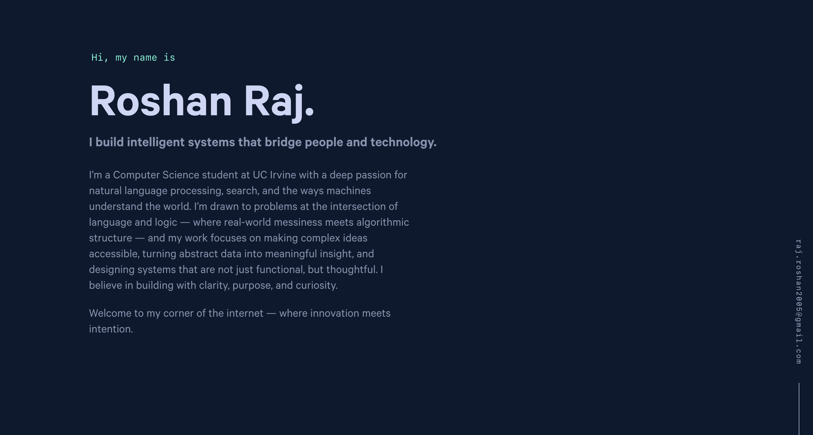

  

<h1 align="center">
  roshanraj.com - v1
</h1>

  The first iteration of <a href="https://roshanraj.com" target="_blank">roshanraj.com</a> built with <a href="https://www.gatsbyjs.org/" target="_blank">Gatsby</a> and hosted with <a href="https://www.netlify.com/" target="_blank">Netlify</a>

  

# 🌐 Roshan Raj — Personal Portfolio

Welcome to my personal website! I'm Roshan, a Computer Science student at UC Irvine passionate about building intelligent systems at the intersection of Natural Language Processing, AI, and full-stack development.

## 🚀 About This Portfolio

This site is a curated showcase of my work, research, and interests. Whether you're a recruiter, collaborator, or fellow technologist, I hope you'll find insight into the problems I love to solve and the technologies I enjoy working with.

## 💡 What You'll Find

- **About Me** — A snapshot of my background, interests, and what drives me.
- **Projects** — Real-world applications I've built, including AI-powered tools, research contributions, and full-stack systems.
- **Resume** — Downloadable PDF of my latest resume.
- **Contact** — The best way to get in touch.

## 🧠 Focus Areas

- Natural Language Processing (NLP)
- Search & Information Retrieval
- Applied Machine Learning
- Scalable Web Development
- Developer Tools & AI UX

## 🛠️ Technologies

- **Languages:** Python, C++, JavaScript
- **Frameworks:** FastAPI, React, Next.js
- **AI/NLP:** Transformers, spaCy, OpenAI API
- **Infrastructure:** Docker, PostgreSQL, OAuth, CI/CD
- **Tools:** Git, GitHub, VS Code, Linux

## �� Connect

If you're looking for someone who enjoys solving challenging problems, communicates clearly, and builds with care, I'd love to connect. Reach out via [LinkedIn](https://www.linkedin.com/in/roshan-raj-9a06a9226/) or [email](mailto:raj.roshan2005@gmail.com).

Thanks for visiting!
